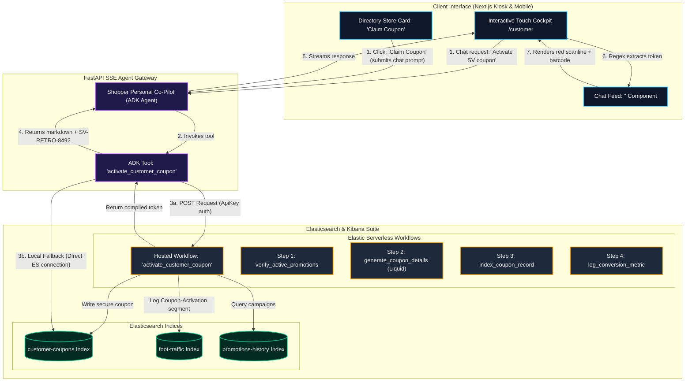
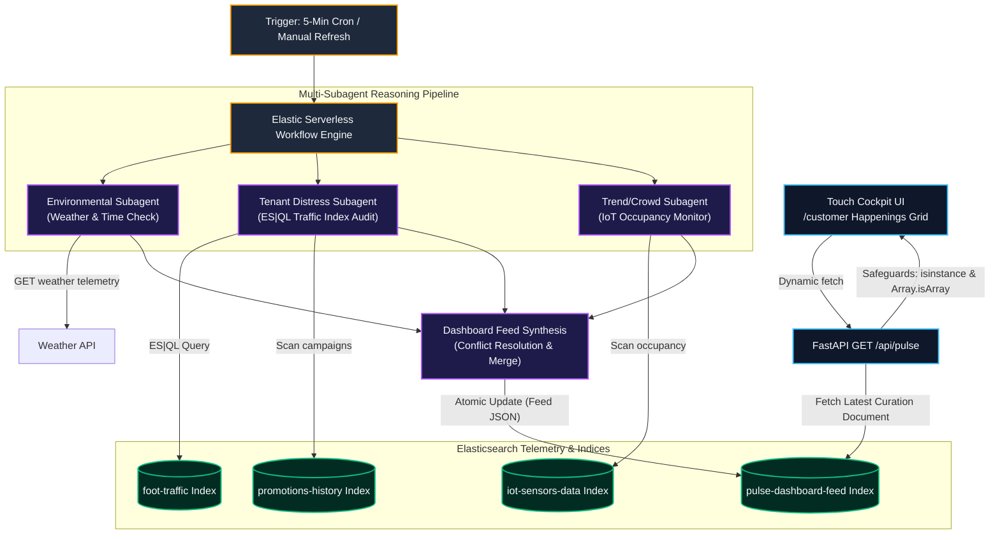

# 🏬 Mall Operations Brain

A multi-step reasoning AI Agent cockpit designed for brick-and-mortar retail operations managers. It acts as an autonomous operational co-pilot rather than a simple chatbot, joining and correlating data across **5 live Elasticsearch indexes** using **ES|QL (Elasticsearch Query Language)**, **Hybrid Vector Searches**, and the **Elastic MCP Server**.

The backend is powered by the **Google Agent Development Kit (ADK) v2.0.0**, running **Gemini 2.5 Flash** as its core intelligence engine.

---

## 🚀 Key Architectures

- **Google ADK v2.0.0 Agent**: Core agent runner built using the official Google ADK, providing native support for tool execution, structured reasoning tracking, and real-time SSE stream outputs.
- **Elastic MCP Server (Agent Builder)**: Native integration with Model Context Protocol (MCP) toolsets. The agent auto-discovers capabilities like schema mappings, ES|QL query execution, and semantic vector searches directly from Elastic.
- **FastAPI SSE Streaming Backend**: Translates intermediate reasoning steps, tool calls, tool results, and final reports into unified, real-time Server-Sent Events (SSE).
- **Glassmorphic Next.js Dashboard**: A premium dark-mode operations terminal that displays live streaming reasoning steps, code blocks of executed ES|QL queries, and interactive results tables.

---

## 🔌 Model Context Protocol (MCP) Server Modes

The Mall Operations Brain automatically supports two connection modes to discover and execute Elasticsearch tools:

### Mode 1: Hosted Elastic Agent Builder (SSE) — *Recommended*
If you have created an agent and enabled the Elasticsearch MCP server in the **Elastic Agent Builder**, configure the hosted endpoint:
* Connects via Server-Sent Events (SSE) directly to the cloud-hosted MCP instance.
* No local node/npm dependencies are required for MCP server execution.
* Secured automatically using your `ELASTICSEARCH_API_KEY`.

### Mode 2: Local Subprocess (Stdio Stdio Connection) — *Fallback*
If no `ELASTIC_MCP_URL` is provided, the backend falls back to spawning the official `@elastic/mcp-server-elasticsearch` npm package as a local stdio subprocess:
* Automatically silences background OpenTelemetry logs (`OTEL_SDK_DISABLED=true`) so telemetry console logs do not pollute the JSON-RPC standard output stream.
* Uses your local environment variables to connect directly to the target Elasticsearch cluster.

---

## 🛠️ Step-by-Step Setup

### 1. Credentials Configuration
Create or edit `backend/.env` with your parameters:

```bash
# === 1. Elastic Cloud Serverless Credentials ===
ELASTICSEARCH_URL=https://your-serverless-deployment.es.us-central1.gcp.elastic.cloud:443
ELASTICSEARCH_API_KEY=your_elasticsearch_api_key

# === 2. Elastic Agent Builder MCP URL (SSE Mode) ===
# Set this to use the hosted MCP server inside the Elastic Agent Builder
ELASTIC_MCP_URL=https://your-agent-builder-mcp-endpoint.elastic.cloud/mcp

# === 3. Google Gemini Credentials (Vertex AI or AI Studio) ===
# Option A: Gemini 2.5 Flash via Google AI Studio
GOOGLE_API_KEY=your_gemini_ai_studio_api_key
MODEL_NAME=gemini-2.5-flash

# Option B: Gemini 2.5 Flash via GCP Vertex AI (Agent Platform API)
# GOOGLE_GENAI_USE_VERTEXAI=true
# GOOGLE_CLOUD_PROJECT=your_gcp_project_id
# GOOGLE_CLOUD_LOCATION=us-central1
```

### 2. Install Dependencies
Create the Python virtual environment (`.venv`), upgrade pip, install backend libraries (including `google-adk[mcp]`), and set up Next.js frontend assets:
```bash
make install
```

### 3. Seed Elasticsearch Indexes
Generate 90 days of synthetic mall time-series, geospatial, and semantic vector data across 7 distinct indices:
```bash
make seed
```
*(Seeded indices: `tenant-sales`, `foot-traffic`, `maintenance-tickets`, `events-calendar`, `promotions-history`, `mall-directory` (geospatial coordinates), and `customer-coupons` (secure activations))*

### 4. Boot Dev Servers
Start the backend FastAPI agent server and Next.js development server:

* **Terminal 1**: Start Backend
  ```bash
  make start-backend
  ```
* **Terminal 2**: Start Frontend
  ```bash
  make start-frontend
  ```

Open your browser at `http://localhost:3000` to access the Glassmorphic Cockpit.

---

## 🧠 Core Diagnostic Flows to Demo

1. **📈 Performance MoM Diagnosis**:
   * *Trigger*: Click the **Sales Diagnosis MoM** chip or type: *"Which stores are underperforming this month vs last month?"*
   * *Logic*: Agent compiles an ES|QL MoM sales query, detects underperforming tenants, checks foot-traffic grids, and evaluates promotions to suggest recoveries.
2. **📣 Campaign Draft Generation**:
   * *Trigger*: Click the **Campaign Composer** chip or type: *"Draft a weekend push for the underperforming east wing."*
   * *Logic*: Agent isolates apparel/retail tenants in the east wing, semantically searches past high-performing marketing copies via dense vector search, and composes an automated push.
3. **🔧 Facility Triage**:
   * *Trigger*: Click the **Facility Triage** chip or type: *"Any facility issues that might be hurting the food court sales?"*
   * *Logic*: Runs a vector search on active maintenance tickets, isolates a major food court ceiling leak, correlates ticket open dates with daily sales trends, and raises financial priority alerts.
4. **⚡ Scheduled Audit Scan**:
   * *Trigger*: Click the **Scheduled Audit Scan** button on the header.
   * *Logic*: Agent evaluates current weekly visitor foot traffic against the rolling 4-week average, triggers warnings if down >20%, and discovers sliding door failures.

---

## 🛍️ Customer AI Cockpit & Shopper Assistant (`/customer`)

We have built a premium customer-facing portal acting as a **Shopper Personal Co-Pilot**. It brings the data-driven convenience of online shopping (personalized recommendations, semantic deal search, and spatial pathfinding) into the physical brick-and-mortar mall.

### 🌐 Key Features

1. **🧭 Backtrack-Free Itinerary Planning**:
   * Shoppers input a time limit (e.g. *3 hours*) and activities (e.g. *buy shoes, eat sushi, get coffee*).
   * The assistant dynamically checks Elasticsearch indexes for active promotions and coordinates, groups activities by floor to eliminate backtracking, and plans a chronological schedule.
2. **🖥️ Widescreen Touchscreen Kiosk Restructuring**:
   * Restructured the widescreen shopper touch dashboard layout, optimizing it for public physical kiosk best practices.
   * **Enlarged 3D Map Viewport (`flex: 1.8`):** Expanded the spatial map rendering card (`.kiosk-map-card`) to provide a much larger, visually prominent site plan.
   * **Unified Touch Left Column (`.kiosk-info-panel`):** Consolidates the directory header, floor filters row, dynamic glassmorphic search input, and dynamic store listings inside a single self-contained scrolling list, reducing touch-point cognitive load.
   * **Interactive Happenings Right Column (`.kiosk-happenings-panel`):** Houses a dedicated, premium advertising strip presenting flash sales, active mall events, and live musical concerts with quick-action click handlers.
3. **📱 Glassmorphic Phone Mockup Frame**:
   * The simulated mobile cockpit is presented in a premium glassmorphic phone mockup centered on the page on desktops.
   * Designed with absolute responsiveness—on physical mobile screens (`< 480px`), the bezel collapses and margins auto-adjust so the UI fills the screen natively.
4. **🎟️ Interactive Highlighted Promotions Strip**:
   * A horizontal scrollable deals carousel queries active store promotions on mobile views.
   * Clicking a deal card auto-fills and triggers a route-planning query directly to the co-pilot.
5. **🗺️ Interactive Walk Itinerary Timeline**:
   * The Next.js frontend dynamically parses the agent's markdown table into a gorgeous vertical schedule timeline.
   * Renders color-coded floor badges (F-1, F-2, F-3), activity icons (👟, 🍣, ☕), step durations, notes, and walking transition nodes along a multi-color timeline line.
6. **🎰 Geospatial Pathfinder & Prompt Offloading**:
   * Coordinates and navigation heuristics are offloaded from prompt memory into a native Elasticsearch index (`mall-directory` with `geo_point` locations).
   * Generates backtrack-free sequences using a native Python pathfinder tool (`calculate_optimal_path`), ensuring 100% mathematical precision.
7. **🎫 Elastic Workflow Coupons & Barcode Scanners**:
   * Standardizes coupon activations using a secure **Elastic Agent Builder Workflow Tool** (`activate_customer_coupon`).
   * Generates cryptographically unique single-use token codes (e.g., `SV-RETRO-4921`), indices them into `customer-coupons`, and logs campaign conversions directly to analytics.
   * Intercepts tokens inside the Next.js chat message feed to render high-fidelity glassmorphic ticket cards complete with visual barcodes and a pulsing neon-red scanner laser animation directly inside the conversation bubble!

---

## 🎟️ Elastic Workflow & Coupon Activation Architecture

The **Elastic Workflow and Coupon Activation** feature is a high-fidelity systemic integration that bridges the gap between AI shopper co-pilot prompts and secure business logic. 

### Systemic Flow Diagram



### Architectural Breakdown

1. **Trigger Points**: 
   * **Chat Input**: Shoppers type coupon activation requests (e.g. *"Claim the SneakerVault discount"*).
   * **Direct Action**: Shoppers click the interactive **🎟️ Claim Coupon** button inside the selected store drawer under the directory sidebar. This auto-fills a standardized activation prompt and triggers the SSE conversation stream.
2. **Shopper Agent Core & Tool Dispatch**:
   * The **Shopper Personal Co-Pilot Agent** intercepts the request and routes it to the native tool `activate_customer_coupon(store_name, discount_desc, shopper_id)`.
3. **Execution Engine (Dual-Path Orchestration)**:
   * **Hosted Workflow API**: The tool attempts a standard `POST` request to the hosted **Elastic Agent Builder Workflow** run endpoint on the serverless cluster. If authenticated, the orchestrator verifies campaigns in `promotions-history`, evaluates dates, writes the verified code record to `customer-coupons`, and records foot-traffic analytics.
   * **Local Database Simulation (Fallback)**: If the remote endpoint is unavailable, the tool uses standard Python `Elasticsearch` APIs to generate a cryptographically structured single-use coupon token (e.g. `SV-RETRO-8492`), writes the document to the local `customer-coupons` index, and logs a completion payload.
4. **Foot-Traffic Analytics Conversion Logging**:
   * Both pathways inject a conversion document with the timestamp and lat/lon coordinates to the `foot-traffic` index under `entrance: "Coupon-Activation"`. This enables active coupons to dynamically reflect as marketing conversion spikes on the manager-facing dashboard.
5. **Regex Chat Feed Interception & Glassmorphism Animation**:
   * The final generated token is streamed back to the Next.js frontend via FastAPI SSE chunks.
   * The UI intercepts it directly inside the conversation message bubbles via matching regex, dynamically displaying a nested digital `<CouponTicket>` with visual barcodes, holographic text, and a glowing neon-red laser scanline pulsing smoothly on a loop.

---

## ⚡ Autonomous Pulse Dashboard & Multi-Subagent Curation Engine

The **Autonomous Pulse Dashboard** is a real-time, closed-loop curation engine that curates the touchscreen kiosk's **Live Happenings & Deals** section dynamically based on environmental data, visitor congestion, and store distress indicators.

### Orchestration System Flow



### Architectural Details

1. **Subagent Orchestration (`ai.prompt`):**
   * **Environmental Subagent:** Checks weather telemetry and local time clocks, shifting the feed's theme dynamically (e.g. promoting indoor movies and ramen on a rainy Sunday, or cold treats and AC zones on a hot weekday).
   * **Tenant Distress Subagent:** Executes high-speed **ES|QL queries** (`elasticsearch.esql.query`) on traffic indices to detect struggling merchants and boosts their active promotions in the "Hot Deals" showcase.
   * **Trend/Crowd Subagent:** Monitors occupancy indexes in the `iot-sensors-data` index. If areas like the Food Court are overcrowded (e.g. occupancy > 80%), it filters out Food Court deals and diverts shoppers to quieter sit-down cafes in the West Wing.
2. **Conflict Resolution & Merge:**
   * Coordinates the outputs from all three subagents to form a clean, conflict-free, and optimized JSON feed array containing exactly 4 happenings cards.
3. **Double-Layer Serialization Safeguards:**
   * **FastAPI Backend Type-Check (`isinstance(curated, list)`):** Validates that only valid list formats bypass indexing, falling back gracefully to static defaults if string anomalies (like workflow `"[object Object]"` strings) occur.
   * **React Frontend Safeguard (`Array.isArray`):** Prevents page crashes during state transitions by checking array types before calling `.map()`.

---

## ⚙️ Multi-Role Dynamic Request Routing

The FastAPI backend exposes a single, unified SSE endpoint at `/api/chat`, supporting dual routing depending on the `role` parameter in the payload:
* `role: "manager"` routes requests to the ADK `manager_runner` for operational analytics (root page `/`).
* `role: "customer"` routes requests to the ADK `customer_runner` linked to the custom `shopper_personal_copilot` agent (customer portal `/customer`).

---

## 🧬 Elastic Agent Builder Workflow YAMLs

The declarative YAML definitions for your Elastic Serverless Workflows are available for direct import:
* **Coupon Activation Workflow:** [activate_customer_coupon_workflow.yaml](file:///Users/I743656/my_projects/mall-opration-manger/activate_customer_coupon_workflow.yaml) (Bridges AI shopper prompts with secure registers barcode issuances).
* **Autonomous Pulse Dashboard Curation Workflow:** [autonomous_pulse_dashboard_workflow.yaml](file:///Users/I743656/my_projects/mall-opration-manger/autonomous_pulse_dashboard_workflow.yaml) (Orchestrates the Environmental, Tenant Distress, and Trend/Crowd multi-subagent curation pipeline).
* **Kibana API Integration:** Can be uploaded via the Kibana API or imported directly under **Kibana UI > Workflows** to link directly to your **Elastic Agent Builder**.

---

## 🛠️ Enterprise Upgrades & Reliability Refinements

To ensure production-grade stability, the cockpit features several custom architecture upgrades:
1. **Bulletproof Native ES|QL Fallback**: Direct Python Elasticsearch connections (`esql`, `esql_query`, `run_esql_query`) run alongside auto-discovered MCP server tools. If cloud-hosted SSE handshake issues occur, the agent seamlessly invokes these native tools, generating clean markdown table formats.
2. **Vertex AI Tool Registration Isolation**: Wrapped multiple alias functions in distinct, unique signatures to prevent Vertex AI duplicate function declaration errors.
3. **Geospatial Offloading**: Replaced in-prompt mathematical heuristics with a dynamic `mall-directory` Elasticsearch index lookup coupled with an optimized Python pathfinder tool. This completely eliminates mathematical/hallucination errors for route sequences.
4. **Resilient Chat Feed Token Interception**: Single-use customer coupons (e.g., `SV-RETRO-4921`) are securely indexed in the `customer-coupons` index and intercepted directly in the chat message thread using frontend regex to dynamically render beautiful glassmorphic neon laser scanning barcode ticket cards.


