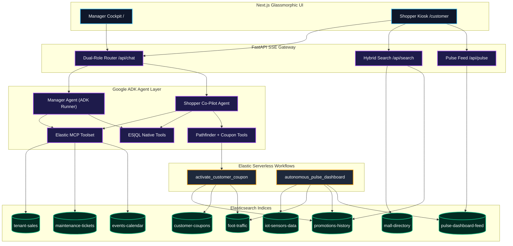
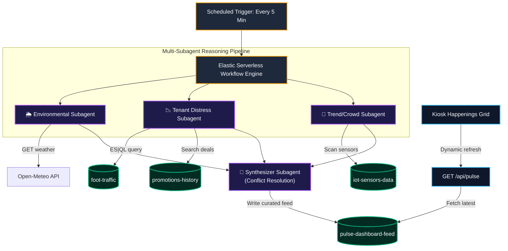
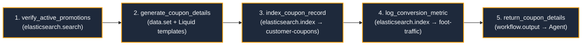
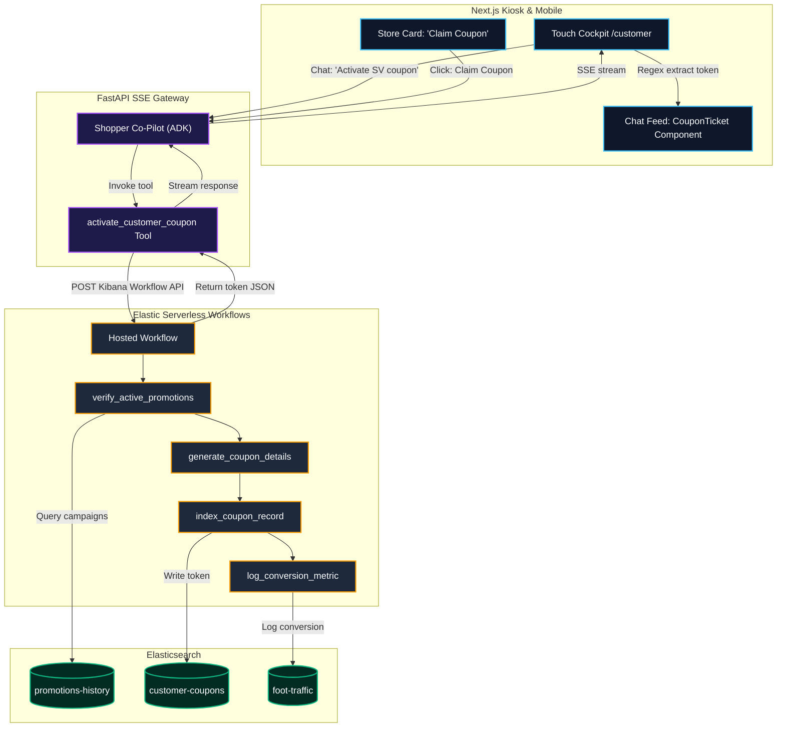

# 🏬 Mall Operations Brain

An autonomous AI operations cockpit for brick-and-mortar retail — not a chatbot, but a **multi-step reasoning agent** that joins, correlates, and acts on live enterprise data across **7 Elasticsearch indices**. It serves two personas from a single platform: a **Manager Cockpit** for operational analytics and a **Shopper Kiosk** for customer-facing pathfinding, deal discovery, and coupon activation.

---

## 📐 Tech Stack

| Layer | Technology |
|-------|-----------|
| **Agent Framework** | Google ADK v2.0.0 (Gemini 2.5 Flash / Pro) |
| **Tool Protocol** | Elastic MCP Server — auto-discovers search, ES\|QL, and index tools via Model Context Protocol |
| **Query Engine** | ES\|QL native tools + Hybrid BM25 / KNN vector search with local `sentence-transformers` embeddings |
| **Orchestration** | Elastic Serverless Workflows (YAML-defined, multi-step, multi-subagent) |
| **Backend** | FastAPI with real-time SSE streaming of reasoning steps, tool calls, and results |
| **Frontend** | Next.js glassmorphic dashboard — dark-mode manager terminal + widescreen kiosk + responsive mobile mockup |
| **Data** | 7 Elasticsearch indices: `tenant-sales`, `foot-traffic`, `maintenance-tickets`, `events-calendar`, `promotions-history`, `mall-directory` (geo_point), `customer-coupons` |
| **Observability** | OpenTelemetry SDK → Elastic APM (OTLP/HTTP) with custom agent health metrics + business impact dashboards in Kibana |

---

## 🏗️ System Architecture



---

## 🔍 Hybrid Retrieval Engine

The agent retrieves context through **three complementary channels**, ensuring it always finds the most relevant data regardless of structure:

### MCP Tool Auto-Discovery
The agent connects to Elasticsearch via the **Elastic MCP Server**, which dynamically exposes search, index listing, and ES|QL query capabilities at runtime. No hardcoded retrieval pipelines — the agent discovers what tools are available and decides how to use them.

Two connection modes are supported:
- **SSE (Hosted):** Connects directly to the cloud-hosted MCP instance in Elastic Agent Builder — zero local dependencies.
- **Stdio (Local):** Falls back to spawning `@elastic/mcp-server-elasticsearch` as a subprocess with `OTEL_SDK_DISABLED=true` to keep JSON-RPC clean.

### ES|QL Analytical Queries
Three native Python tools (`esql`, `esql_query`, `run_esql_query`) wrap the `es.esql.query()` API, parse columnar responses, and return formatted markdown tables the LLM can reason over directly. The system prompt includes ES|QL syntax guidance (e.g. `DATE_TRUNC`, quoting rules, pipe syntax), enabling Gemini to **compose arbitrary analytical queries at runtime**:

```sql
FROM tenant-sales
| WHERE sale_date >= "2026-04-01" AND sale_date < "2026-05-01"
| STATS monthly_total = SUM(revenue) BY store_name
| SORT monthly_total DESC
| LIMIT 10
```

### Multi-Index Hybrid Search
The `/api/search` endpoint fuses results from two indices in a single query:

| Layer | Index | Technique | Details |
|-------|-------|-----------|---------|
| **Lexical BM25** | `mall-directory` | Multi-field keyword match | Boosted scoring: `store_name` (4.0×), `category` (2.5×), `keywords` (2.0×), `description` (1.0×) |
| **Dense Vector KNN** | `promotions-history` | Semantic similarity | Query embedded via `sentence-transformers/all-MiniLM-L6-v2`, matched against `copy_vector` |
| **Score Fusion** | Both | Weighted merge | Promo scores scaled 15× and fused with lexical hits, sorted descending |

---

## 🔄 Elasticsearch as a Living Memory Layer

Elasticsearch is not just a data source — it is the agent's **persistent memory**. Every meaningful action the agent takes writes enriched outputs back into ES indices, building retrievable intelligence over time:

| Agent Action | What Gets Written | Target Index |
|---|---|---|
| Coupon activation | Structured token record (`coupon_id`, `token`, `expires_at`, `is_redeemed`) | `customer-coupons` |
| Conversion tracking | Timestamped geo-coordinate event under `entrance: "Coupon-Activation"` | `foot-traffic` |
| Dashboard curation | AI-synthesized happenings/deals cards (from 3 subagent outputs + conflict resolution) | `pulse-dashboard-feed` |

The **read-back cycle** closes the loop: the `/api/pulse` endpoint fetches the latest AI-curated feed from `pulse-dashboard-feed` and serves it to the kiosk. The manager dashboard queries `foot-traffic` to visualize coupon conversion spikes. Future reasoning cycles query `customer-coupons` to avoid duplicate activations. Every agent action enriches the data that future agent actions can retrieve.

---

## ⚡ Autonomous Pulse Dashboard — Multi-Subagent Curation

The kiosk's **Live Happenings & Deals** section is not static content — it is curated autonomously by a **scheduled Elastic Workflow** that orchestrates 3 specialized AI subagents every 5 minutes, each with its own data sources and reasoning skills:



### How Each Subagent Works

| Subagent | Data Source | Reasoning Skill | Example Output |
|----------|-----------|-----------------|----------------|
| **🌦️ Environmental** | External weather API + system clock | Weather-aware theming | Rainy Sunday → promote indoor movies & ramen; Hot weekday → cold treats & AC zones |
| **📉 Tenant Distress** | ES\|QL on `foot-traffic` + `promotions-history` | Struggling-store detection | Low-traffic merchants get their active deals boosted to the "Hot Deals" showcase |
| **👥 Trend/Crowd** | `iot-sensors-data` occupancy sensors | Overcrowding detection | Food Court at >80% occupancy → divert shoppers to quieter West Wing cafés |
| **🧠 Synthesizer** | Combined outputs from all 3 above | Conflict resolution | Environmental wants Food Court comfort food, but Crowd says overcrowded → pick alternatives |

Each subagent is a self-contained `ai.prompt` workflow step with its own system prompt, skill context, and data inputs — **isolating context windows and managing token cost**. The final synthesized feed (exactly 4 curated cards) is written atomically to `pulse-dashboard-feed`, and the kiosk picks it up on the next refresh — **zero human intervention**.

---

## 🎟️ Cross-System Workflow: Coupon Activation Engine

The coupon system demonstrates how an Elastic Workflow can **read from one index, write to two others, call external APIs, and return structured data to the agent** — all in a single deterministic execution triggered by the LLM:



**The full chain:** Shopper asks the co-pilot → ADK agent calls `activate_customer_coupon` tool → Python gateway triggers the hosted Elastic Workflow via the Kibana API → Workflow verifies campaign in `promotions-history`, writes token to `customer-coupons`, logs conversion to `foot-traffic` → Returns structured JSON → Frontend intercepts the token via regex and renders a glassmorphic barcode ticket card with a pulsing neon scanner laser.



---

## 🛍️ Shopper AI Cockpit (`/customer`)

A customer-facing portal that acts as a **Shopper Personal Co-Pilot**, bringing the data-driven convenience of online shopping into the physical mall:

### Backtrack-Free Itinerary Planning
Shoppers input a time limit and activities (e.g. *"3 hours: buy shoes, eat sushi, get coffee"*). The agent queries Elasticsearch for active promotions and store coordinates, then uses a native Python pathfinder tool (`calculate_optimal_path`) against the `mall-directory` geo_point index to generate a **mathematically optimal, backtrack-free route** grouped by floor. The frontend renders it as a gorgeous vertical timeline with color-coded floor badges, activity icons, step durations, and walking transitions.

### Widescreen Touchscreen Kiosk Layout
Optimized for physical public kiosks with three columns:
- **Left Column** — Unified directory panel with floor filters, glassmorphic search input, and scrollable store listings
- **Center Column** — Enlarged 3D map viewport (`flex: 1.8`) for spatial orientation
- **Right Column** — Live happenings strip with flash sales, events, and concerts (powered by the Autonomous Pulse Dashboard above)

### Responsive Mobile Mockup
On desktop, the mobile view is presented in a premium glassmorphic phone bezel. On physical mobile screens (`< 480px`), the bezel collapses and the UI fills the screen natively. A horizontal scrollable deals carousel auto-fills route-planning queries on tap.

### Interactive Coupon Ticket Cards
When the agent activates a coupon, the token (e.g. `SV-RETRO-4921`) is intercepted directly inside the chat message feed via regex and rendered as a high-fidelity glassmorphic ticket with visual barcodes and a pulsing neon-red scanner laser animation — all inline within the conversation bubble.

---

## 🧠 Manager Diagnostic Flows

The manager cockpit (`/`) exposes multi-step analytical reasoning over all 7 indices:

| Flow | Trigger | What the Agent Does |
|------|---------|-------------------|
| **📈 Sales Diagnosis MoM** | Chip or *"Which stores underperformed this month vs last?"* | Compiles an ES\|QL month-over-month revenue query, detects underperformers, cross-references foot-traffic grids, and evaluates promotion history to suggest recoveries |
| **📣 Campaign Composer** | Chip or *"Draft a weekend push for the east wing"* | Isolates apparel/retail tenants in the east wing, runs a **dense vector search** on past high-performing marketing copy in `promotions-history`, and composes an automated campaign |
| **🔧 Facility Triage** | Chip or *"Any facility issues hurting food court sales?"* | Runs a **semantic vector search** on `maintenance-tickets`, isolates a ceiling leak, correlates ticket dates with daily sales trends, and raises financial priority alerts |
| **⚡ Scheduled Audit Scan** | Header button | Evaluates weekly foot traffic against the rolling 4-week average, triggers warnings if down >20%, discovers sliding door failures |

Each flow demonstrates the agent **composing its own ES|QL queries, choosing between keyword and vector search, and chaining multiple tool calls** in a single reasoning trace — all streamed to the UI in real time via SSE.

---

## 🛠️ Setup

### 1. Configure Credentials
Create `backend/.env`:

```bash
# Elastic Cloud Serverless
ELASTICSEARCH_URL=https://your-deployment.es.us-central1.gcp.elastic.cloud:443
ELASTICSEARCH_API_KEY=your_api_key

# Elastic Agent Builder MCP (SSE mode)
ELASTIC_MCP_URL=https://your-mcp-endpoint.elastic.cloud/mcp

# Google Gemini (AI Studio or Vertex AI)
GOOGLE_API_KEY=your_gemini_key
MODEL_NAME=gemini-2.5-flash
```

### 2. Install Dependencies
```bash
make install
```

### 3. Seed Elasticsearch
Generate 90 days of synthetic time-series, geospatial, and vector data across all indices:
```bash
make seed
```

### 4. Start Dev Servers
```bash
# Terminal 1 — Backend
make start-backend

# Terminal 2 — Frontend
make start-frontend
```

Open `http://localhost:3000` → Manager Cockpit, or `http://localhost:3000/customer` → Shopper Kiosk.

---

## ⚙️ Request Routing

The FastAPI backend exposes a unified SSE endpoint at `/api/chat` with dual routing:
- `role: "manager"` → ADK `manager_runner` (operational analytics on `/`)
- `role: "customer"` → ADK `customer_runner` linked to `shopper_personal_copilot` agent (`/customer`)

---

## 📦 Workflow YAML Definitions

Importable directly into **Kibana UI → Workflows** or via the Kibana API:

| Workflow | Purpose |
|----------|---------|
| `activate_customer_coupon_workflow.yaml` | Bridges AI shopper prompts with secure coupon issuance — verifies campaigns, writes tokens, logs conversions |
| `autonomous_pulse_dashboard_workflow.yaml` | Orchestrates 3 AI subagents (Environmental, Tenant Distress, Trend/Crowd) on a 5-min schedule to curate the kiosk dashboard feed |

---

## 📊 Live Agent Observability & Business Dashboards

The backend is instrumented with **OpenTelemetry** to trace every reasoning step of the Google ADK agent, measure tool execution latencies, and export custom metrics to **Elastic APM** via OTLP/HTTP. This provides a complete operational picture — not just of the mall, but of the AI system itself.

### Instrumentation Architecture

Every agent session flows through a **root trace span** (`agent.session`) that captures the full lifecycle: user message → reasoning phases → tool calls → final answer. Each tool invocation (ES|QL queries, coupon activations, pathfinder calculations) gets its own **child span** with execution status, latency, and business attributes.

Custom metrics are registered for both **agent health** and **business impact**:

| Metric | Type | What It Tracks |
|--------|------|---------------|
| `agent.tokens.consumed` | Counter | Estimated token burn per session, segmented by agent role |
| `agent.reasoning.duration_ms` | Histogram | Time spent in LLM "thinking" phases vs tool execution |
| `agent.tool.calls` | Counter | Tool invocations by name and success/error status |
| `agent.esql.queries` | Counter | ES\|QL query throughput and error rate |
| `coupon.activations` | Counter | Coupon tokens generated, split by workflow vs local fallback |
| `pulse.workflow.runs` | Counter | Autonomous dashboard feed refreshes observed |

### Kibana Dashboard

An importable Kibana dashboard (`observability/agent_dashboard.ndjson`) is split into two hemispheres:

- **🤖 Agent Health** — Token burn rate timeline, reasoning vs tool latency histogram, tool success donut chart, ES\|QL query volume area chart, active session counter
- **🏬 Business Impact** — AI-driven coupon conversion counters, pulse workflow execution timeline, activation method pie chart, foot traffic heatmap (zone × hour), workflow API health gauge

When no OTLP endpoint is configured, the system falls back to **console exporters** — traces and metrics are printed to stdout for local development with zero external dependencies.

> See the full setup guide at [`observability/README.md`](file:///Users/I743656/my_projects/mall-opration-manger/observability/README.md).

---

## 🔒 Reliability & Production Hardening

| Feature | Detail |
|---------|--------|
| **Native ES\|QL Fallback** | If the cloud-hosted MCP handshake fails, the agent falls back to direct `es.esql.query()` Python tools transparently |
| **Dual-Path Workflow Execution** | Coupon tool tries the hosted Kibana Workflow API first, falls back to local `elasticsearch-py` simulation |
| **Geospatial Offloading** | Route math is offloaded from the LLM prompt to a native pathfinder tool + `mall-directory` geo_point index — eliminates hallucination |
| **Double-Layer Serialization Guards** | Backend validates `isinstance(data, list)` before returning; frontend validates `Array.isArray()` before rendering — prevents `[object Object]` crashes |
| **Tool Registration Isolation** | Multiple ES\|QL alias functions wrapped in distinct signatures to prevent Vertex AI duplicate declaration errors |
