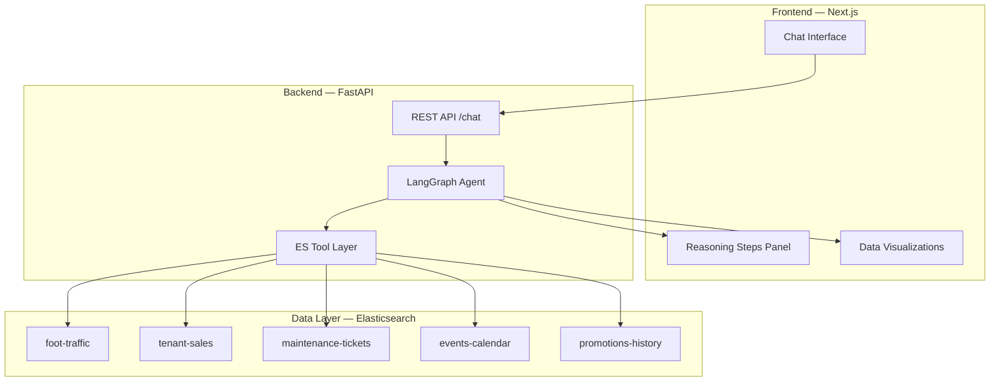
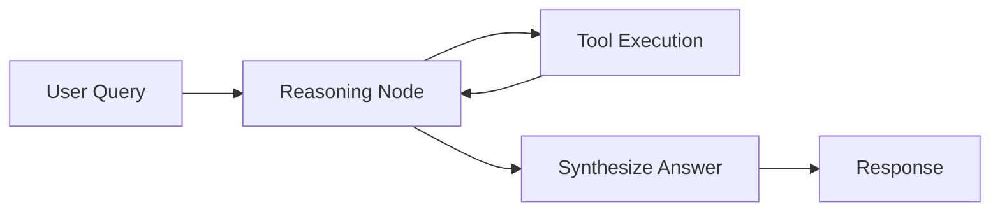

# Mall Operations Brain — Implementation Plan

A multi-step AI agent system that lets mall operations managers ask natural language questions and receive actionable intelligence powered by Elasticsearch across 5 live data indexes.

## User Review Required

> [!IMPORTANT]
> **Elasticsearch hosting**: This plan uses a **local Docker Compose** setup (single-node ES 8.15 with security disabled). If you have an existing Elastic Cloud deployment or want to use Elastic Cloud, let me know — it changes the connection config and enables ELSER/ML features natively.

> [!IMPORTANT]
> **LLM provider**: The agent needs an LLM for reasoning. The plan defaults to **OpenAI GPT-4o** via LangChain. If you prefer a different provider (Anthropic Claude, Google Gemini, local Ollama, etc.), specify it and I'll adjust.

> [!WARNING]
> **ELSER / Semantic Search**: ELSER (Elastic's built-in sparse embedding model) requires an ML node and a Platinum+ license. For a local Docker setup, we'll use **sentence-transformers** to generate dense embeddings client-side and store them as `dense_vector` fields. This still gives us hybrid search (keyword + semantic) — just computed outside ES. If you have Elastic Cloud with ML nodes, we can use ELSER natively instead.

> [!IMPORTANT]
> **Elastic MCP Server**: The Elastic MCP server requires Kibana 9.2+ with Agent Builder enabled. For local development, I'll build a **custom MCP-style tool layer** that wraps Elasticsearch queries as LangChain tools (ESQL, hybrid search, geo queries). This is functionally identical to what the Elastic MCP exposes, and can be swapped for the real MCP server if you deploy to Elastic Cloud later.

## Open Questions

1. **Do you have an Elastic Cloud account**, or should we go fully local with Docker?
2. **Which LLM provider** do you want to use? (OpenAI, Anthropic, Google, local Ollama?)
3. **Is this for the Elastic Agent Builder Hackathon** (Jan–Feb 2026), or are you building this independently? This affects whether we integrate with Agent Builder UI or build our own.
4. **Demo video priority**: Should the UI be web-based (Next.js) or would a simpler terminal/Streamlit UI suffice for an MVP?

---

## Architecture Overview



### Tech Stack

| Layer | Technology | Why |
|:---|:---|:---|
| **Infrastructure** | Docker Compose (ES 8.15 single-node) | Zero-config local dev, reproducible |
| **Data Generation** | Python + Faker | Realistic synthetic mall data |
| **Backend** | FastAPI + LangGraph + LangChain | Streaming agent with tool orchestration |
| **ES Tools** | elasticsearch-py (ESQL + DSL) | Direct ES queries, hybrid search |
| **Embeddings** | sentence-transformers (all-MiniLM-L6-v2) | Client-side dense embeddings for semantic search |
| **Frontend** | Next.js 15 (App Router) | SSE streaming, rich chat UI |
| **Styling** | Vanilla CSS with CSS custom properties | Premium dark-mode glassmorphism design |

---

## Proposed Changes

### Component 1: Infrastructure

#### [NEW] [docker-compose.yml](file:///Users/I743656/my_projects/mall-opration-manger/docker-compose.yml)

Single-node Elasticsearch 8.15 with:
- Security disabled for local dev
- Port 9200 exposed
- Persistent volume for data
- Kibana optional (port 5601) for debugging

```yaml
services:
  elasticsearch:
    image: docker.elastic.co/elasticsearch/elasticsearch:8.15.0
    environment:
      - discovery.type=single-node
      - xpack.security.enabled=false
      - ES_JAVA_OPTS=-Xms1g -Xmx1g
    ports:
      - "9200:9200"
    volumes:
      - esdata:/usr/share/elasticsearch/data

  kibana:
    image: docker.elastic.co/kibana/kibana:8.15.0
    environment:
      - ELASTICSEARCH_HOSTS=http://elasticsearch:9200
    ports:
      - "5601:5601"
    depends_on:
      - elasticsearch

volumes:
  esdata:
```

---

### Component 2: Synthetic Data Generation

#### [NEW] [data-generator/](file:///Users/I743656/my_projects/mall-opration-manger/data-generator/)

Python package to generate and index realistic mall data into all 5 ES indexes.

#### [NEW] [data-generator/requirements.txt](file:///Users/I743656/my_projects/mall-opration-manger/data-generator/requirements.txt)

```
elasticsearch>=8.15
faker
numpy
sentence-transformers
```

#### [NEW] [data-generator/config.py](file:///Users/I743656/my_projects/mall-opration-manger/data-generator/config.py)

Mall topology constants — zones, stores, categories, geo coordinates:

```python
MALL_ZONES = {
    "food-court":       {"floor": 1, "lat": 24.7136, "lon": 46.6753},
    "electronics-wing": {"floor": 2, "lat": 24.7138, "lon": 46.6755},
    "fashion-district": {"floor": 1, "lat": 24.7134, "lon": 46.6751},
    "services-hub":     {"floor": 3, "lat": 24.7140, "lon": 46.6757},
    "entrance-a":       {"floor": 0, "lat": 24.7132, "lon": 46.6749},
    "entrance-b":       {"floor": 0, "lat": 24.7142, "lon": 46.6759},
    "entrance-c":       {"floor": 0, "lat": 24.7136, "lon": 46.6761},
    "parking":          {"floor": -1, "lat": 24.7130, "lon": 46.6745},
    "east-wing":        {"floor": 1, "lat": 24.7139, "lon": 46.6758},
    "west-wing":        {"floor": 1, "lat": 24.7133, "lon": 46.6748},
}

STORES = [
    {"name": "TechZone", "zone": "electronics-wing", "category": "electronics"},
    {"name": "ByteShop", "zone": "electronics-wing", "category": "electronics"},
    {"name": "FashionHub", "zone": "fashion-district", "category": "apparel"},
    {"name": "StyleCraft", "zone": "fashion-district", "category": "apparel"},
    {"name": "Urban Threads", "zone": "east-wing", "category": "apparel"},
    {"name": "Burger Barn", "zone": "food-court", "category": "food"},
    {"name": "Sushi Express", "zone": "food-court", "category": "food"},
    {"name": "Pizza Palace", "zone": "food-court", "category": "food"},
    {"name": "Café Bloom", "zone": "food-court", "category": "food"},
    {"name": "QuickFix Phones", "zone": "services-hub", "category": "services"},
    {"name": "GlamCuts Salon", "zone": "services-hub", "category": "services"},
    {"name": "SneakerVault", "zone": "east-wing", "category": "apparel"},
    {"name": "GameWorld", "zone": "electronics-wing", "category": "electronics"},
    {"name": "HomeStyle", "zone": "west-wing", "category": "home"},
    {"name": "BookNook", "zone": "west-wing", "category": "lifestyle"},
]
```

#### [NEW] [data-generator/generators.py](file:///Users/I743656/my_projects/mall-opration-manger/data-generator/generators.py)

Five generator functions, each producing realistic documents:

1. **`generate_foot_traffic(days=90)`** — Hourly visitor counts per zone, with:
   - Realistic daily patterns (low at 8am, peak at 2pm and 7pm, drop at 10pm)
   - Weekend multiplier (1.4x)
   - Random noise ±15%
   - Geo coordinates per zone

2. **`generate_tenant_sales(days=90)`** — Daily revenue per store with:
   - Base revenue per category (electronics: $2k-8k, food: $500-2k, apparel: $1k-5k)
   - Intentional underperformance for 3 stores in the current month (for demo queries)
   - Weekend uplift
   - Category-specific seasonality

3. **`generate_maintenance_tickets(count=50)`** — Facility issues with:
   - Realistic descriptions via Faker + templates ("HVAC unit malfunction in Zone X", "Water leak near Store Y")
   - Severity: critical/high/medium/low
   - Status: open/in-progress/closed
   - Intentional clustering of open tickets in food-court zone (for Flow 3 demo)
   - Dense vector embeddings on description field

4. **`generate_events_calendar(count=20)`** — Past and future events:
   - Event types: sale, concert, food-festival, workshop, seasonal
   - Expected attendance ranges
   - Zone impact mapping

5. **`generate_promotions_history(count=30)`** — Past campaigns with:
   - Participating tenant lists
   - Target zones
   - A/B outcome: sales_lift_percent (some positive, some flat)
   - Campaign copy text with embeddings

#### [NEW] [data-generator/indexer.py](file:///Users/I743656/my_projects/mall-opration-manger/data-generator/indexer.py)

- Creates index mappings (with proper `geo_point`, `date`, `keyword`, `dense_vector` types)
- Bulk-indexes all generated data using `helpers.bulk`
- Idempotent: deletes and recreates indexes on each run

#### [NEW] [data-generator/main.py](file:///Users/I743656/my_projects/mall-opration-manger/data-generator/main.py)

CLI entry point: `python -m data-generator.main`

---

### Component 3: Backend — FastAPI Agent Server

#### [NEW] [backend/](file:///Users/I743656/my_projects/mall-opration-manger/backend/)

#### [NEW] [backend/requirements.txt](file:///Users/I743656/my_projects/mall-opration-manger/backend/requirements.txt)

```
fastapi
uvicorn[standard]
langchain
langchain-openai
langgraph
elasticsearch>=8.15
sentence-transformers
python-dotenv
sse-starlette
pydantic
```

#### [NEW] [backend/.env.example](file:///Users/I743656/my_projects/mall-opration-manger/backend/.env.example)

```
ELASTICSEARCH_URL=http://localhost:9200
OPENAI_API_KEY=sk-...
MODEL_NAME=gpt-4o
```

#### [NEW] [backend/app/config.py](file:///Users/I743656/my_projects/mall-opration-manger/backend/app/config.py)

Pydantic settings loading from `.env`

#### [NEW] [backend/app/es_client.py](file:///Users/I743656/my_projects/mall-opration-manger/backend/app/es_client.py)

Singleton Elasticsearch client with connection pooling

#### [NEW] [backend/app/tools/](file:///Users/I743656/my_projects/mall-opration-manger/backend/app/tools/)

LangChain tool definitions that wrap Elasticsearch queries. This is the **custom MCP-equivalent layer**.

##### [NEW] [backend/app/tools/esql_query.py](file:///Users/I743656/my_projects/mall-opration-manger/backend/app/tools/esql_query.py)

Tool: `run_esql_query` — Executes arbitrary ESQL queries against ES. The agent composes ESQL dynamically based on the user's question.

```python
@tool
def run_esql_query(query: str) -> str:
    """Execute an ES|QL query against mall data indexes.
    
    Use this for structured aggregations: monthly revenue comparisons,
    foot traffic trends, store rankings, zone-level statistics.
    
    Args:
        query: A valid ES|QL query string.
    """
    response = es_client.esql.query(query=query)
    return format_esql_response(response)
```

##### [NEW] [backend/app/tools/semantic_search.py](file:///Users/I743656/my_projects/mall-opration-manger/backend/app/tools/semantic_search.py)

Tool: `semantic_search` — Hybrid keyword + vector search on maintenance-tickets and promotions-history.

```python
@tool
def semantic_search(index: str, query_text: str, filters: dict = None) -> str:
    """Search maintenance tickets or promotion history using semantic similarity.
    
    Use this when searching by meaning rather than exact terms.
    Supports filters on zone, status, severity, date range.
    """
    # 1. Encode query_text with sentence-transformers
    # 2. Build hybrid query: bool(must=[knn_vector, match_text])
    # 3. Apply filters
    # 4. Return top results with scores
```

##### [NEW] [backend/app/tools/foot_traffic.py](file:///Users/I743656/my_projects/mall-opration-manger/backend/app/tools/foot_traffic.py)

Tool: `get_foot_traffic` — Time-series queries with geo filtering.

##### [NEW] [backend/app/tools/tenant_performance.py](file:///Users/I743656/my_projects/mall-opration-manger/backend/app/tools/tenant_performance.py)

Tool: `compare_tenant_sales` — Month-over-month, week-over-week deltas per store/zone.

##### [NEW] [backend/app/tools/events.py](file:///Users/I743656/my_projects/mall-opration-manger/backend/app/tools/events.py)

Tool: `search_events` — Query events calendar by date range, zone, type.

##### [NEW] [backend/app/tools/promotions.py](file:///Users/I743656/my_projects/mall-opration-manger/backend/app/tools/promotions.py)

Tool: `search_promotions` — Keyword + semantic search on past campaigns.

#### [NEW] [backend/app/agent/](file:///Users/I743656/my_projects/mall-opration-manger/backend/app/agent/)

##### [NEW] [backend/app/agent/graph.py](file:///Users/I743656/my_projects/mall-opration-manger/backend/app/agent/graph.py)

**LangGraph state machine** — the core agent reasoning engine:



The graph has:
- **State**: `messages`, `reasoning_steps[]`, `tool_results[]`, `iteration_count`
- **Reasoning Node**: LLM decides next action (call tool or synthesize)
- **Tool Node**: Executes the selected ES tool, appends result to state
- **Synthesis Node**: Generates final response with citations
- **Max iterations**: 8 (prevents runaway loops)

##### [NEW] [backend/app/agent/prompts.py](file:///Users/I743656/my_projects/mall-opration-manger/backend/app/agent/prompts.py)

System prompt that defines:
- Mall topology awareness (zones, stores, categories)
- Multi-step reasoning strategy
- When to use ESQL vs semantic search
- Output formatting (tables, action items, recommendations)
- Flow-specific guidance for the 4 agent capabilities

##### [NEW] [backend/app/agent/flows.py](file:///Users/I743656/my_projects/mall-opration-manger/backend/app/agent/flows.py)

Pre-defined multi-step flow templates for the 4 core capabilities:

**Flow 1 — Performance Diagnosis:**
1. ESQL: current month revenue by store
2. ESQL: prior month revenue by store  
3. Calculate deltas, rank by drop
4. Foot traffic: check if zone traffic dropped (systemic) or store-specific
5. Promotions: check if last month had campaigns that inflated numbers
6. Synthesize: ranked at-risk stores with root cause

**Flow 2 — Campaign Generation:**
1. Semantic search: similar past campaigns in target zone
2. Events: check upcoming events this weekend
3. ESQL: tenant list in target zone with recent performance
4. Synthesize: campaign draft with stores, discounts, timing, copy

**Flow 3 — Maintenance Triage:**
1. Semantic search: open maintenance tickets in target zone
2. ESQL: sales trends in that zone for the past 2 weeks
3. Correlate ticket open dates with sales drops
4. Synthesize: prioritized issue list with impact assessment

**Flow 4 — Anomaly Alert:**
1. ESQL: current week traffic vs 4-week rolling average per zone
2. Identify zones with >20% drop
3. Maintenance: check for open tickets in flagged zones
4. Events: check for event conflicts
5. Synthesize: alert with root cause hypothesis and suggested action

#### [NEW] [backend/app/main.py](file:///Users/I743656/my_projects/mall-opration-manger/backend/app/main.py)

FastAPI app with:
- `POST /api/chat` — SSE streaming endpoint
- `GET /api/health` — Health check
- `POST /api/anomaly-scan` — Trigger proactive anomaly check (Flow 4)
- CORS middleware for frontend

The `/api/chat` endpoint streams JSON events:
```json
{"type": "reasoning_step", "content": "Querying tenant sales for current month..."}
{"type": "tool_call", "tool": "run_esql_query", "input": "FROM tenant-sales | ..."}
{"type": "tool_result", "tool": "run_esql_query", "output": "..."}
{"type": "reasoning_step", "content": "Found 3 stores with >15% revenue drop..."}
{"type": "final_answer", "content": "## Performance Report\n..."}
```

---

### Component 4: Frontend — Next.js Chat UI

#### [NEW] [frontend/](file:///Users/I743656/my_projects/mall-opration-manger/frontend/)

Created via `npx -y create-next-app@latest ./` with App Router, no Tailwind, no `src/` dir.

#### [NEW] [frontend/app/globals.css](file:///Users/I743656/my_projects/mall-opration-manger/frontend/app/globals.css)

Premium dark-mode design system:
- **Color palette**: Deep navy (#0a0e1a) base, electric blue (#3b82f6) accents, emerald (#10b981) for success, amber (#f59e0b) for warnings
- **Glassmorphism**: Frosted glass panels with backdrop-blur
- **Typography**: Inter (Google Fonts)
- **Animations**: Smooth transitions, pulse effects for streaming, slide-in for reasoning steps

#### [NEW] [frontend/app/layout.jsx](file:///Users/I743656/my_projects/mall-opration-manger/frontend/app/layout.jsx)

Root layout with Inter font, metadata, dark theme

#### [NEW] [frontend/app/page.jsx](file:///Users/I743656/my_projects/mall-opration-manger/frontend/app/page.jsx)

Main chat page — full-screen layout:

```
┌──────────────────────────────────────────────┐
│  🏬 Mall Operations Brain         [⚡ Scan]  │
├──────────┬───────────────────────────────────┤
│          │                                   │
│ Quick    │     Chat Messages Area            │
│ Actions  │                                   │
│          │  ┌─ Reasoning Steps (collapsible)─┐│
│ • Perf   │  │ 📊 Querying tenant sales...   ││
│   Report │  │ 🔍 Checking foot traffic...   ││
│          │  │ 📈 Analyzing promotions...     ││
│ • Draft  │  └───────────────────────────────┘│
│   Campaign│                                  │
│          │  ┌─ Final Answer ────────────────┐│
│ • Maint  │  │ ## At-Risk Stores             ││
│   Triage │  │ | Store | Drop | Cause |      ││
│          │  │ ...                            ││
│ • Anomaly│  └───────────────────────────────┘│
│   Scan   │                                   │
│          ├───────────────────────────────────┤
│          │  [Type your question...    ] [Send]│
└──────────┴───────────────────────────────────┘
```

#### [NEW] [frontend/app/components/ChatMessage.jsx](file:///Users/I743656/my_projects/mall-opration-manger/frontend/app/components/ChatMessage.jsx)

Message bubble component with:
- User messages (right-aligned, blue gradient)
- Agent messages (left-aligned, glass panel)
- Markdown rendering for final answers
- Inline tables and code blocks

#### [NEW] [frontend/app/components/ReasoningSteps.jsx](file:///Users/I743656/my_projects/mall-opration-manger/frontend/app/components/ReasoningSteps.jsx)

Collapsible panel showing the agent's multi-step reasoning:
- Each step with icon (🔍 search, 📊 query, 🧠 reasoning, ✅ done)
- Animated step-by-step reveal during streaming
- ESQL queries shown in syntax-highlighted code blocks
- Tool results shown as formatted data

#### [NEW] [frontend/app/components/ChatInput.jsx](file:///Users/I743656/my_projects/mall-opration-manger/frontend/app/components/ChatInput.jsx)

Input bar with:
- Auto-resize textarea
- Send button with loading state
- Suggested quick queries (chips above input)

#### [NEW] [frontend/app/components/Sidebar.jsx](file:///Users/I743656/my_projects/mall-opration-manger/frontend/app/components/Sidebar.jsx)

Left sidebar with:
- Quick action buttons for the 4 flows
- Mall status indicator (ES connection)
- Recent conversations list

#### [NEW] [frontend/lib/api.js](file:///Users/I743656/my_projects/mall-opration-manger/frontend/lib/api.js)

API client with SSE streaming support:
```javascript
export async function streamChat(message, onEvent) {
  const response = await fetch('/api/chat', {
    method: 'POST',
    body: JSON.stringify({ message }),
  });
  
  const reader = response.body.getReader();
  // Parse SSE events and call onEvent for each
}
```

---

### Component 5: Project Root Files

#### [NEW] [README.md](file:///Users/I743656/my_projects/mall-opration-manger/README.md)

Comprehensive README with architecture diagram, setup instructions, demo walkthrough

#### [NEW] [.gitignore](file:///Users/I743656/my_projects/mall-opration-manger/.gitignore)

Standard Python + Node.js ignores, `.env` files

#### [NEW] [Makefile](file:///Users/I743656/my_projects/mall-opration-manger/Makefile)

Convenience targets:
- `make infra` — docker compose up
- `make seed` — run data generator
- `make backend` — start FastAPI
- `make frontend` — start Next.js
- `make dev` — all of the above
- `make clean` — tear down everything

---

## Build Order

| Phase | What | Estimated Time |
|:---|:---|:---|
| **1** | Infrastructure (Docker Compose) | 15 min |
| **2** | Data Generator (all 5 indexes) | 1–2 hrs |
| **3** | Backend: ES client + Tools | 1–2 hrs |
| **4** | Backend: LangGraph Agent | 2–3 hrs |
| **5** | Backend: FastAPI streaming API | 30 min |
| **6** | Frontend: Next.js chat UI | 2–3 hrs |
| **7** | Integration testing + polish | 1–2 hrs |

---

## Verification Plan

### Automated Tests

1. **Data integrity**: After seeding, verify each index has expected document count via `GET _cat/count`
2. **ESQL queries**: Run sample ESQL queries against seeded data and verify non-empty results
3. **Semantic search**: Verify vector search on maintenance tickets returns semantically relevant results
4. **Agent flows**: Test each of the 4 flows with known queries and verify multi-step reasoning
5. **API streaming**: Verify SSE events stream correctly with proper event types

### Manual Verification

1. **Browser test**: Open the Next.js UI, type each demo query, verify:
   - Reasoning steps appear progressively
   - ESQL queries are visible in reasoning panel
   - Final answer contains formatted tables/lists
   - Quick action buttons trigger correct flows
2. **Demo flow**: Record the 3-minute demo sequence:
   - Performance diagnosis query → multi-step reasoning → actionable report
   - Campaign generation → contextualized draft
   - Maintenance triage → correlated findings
